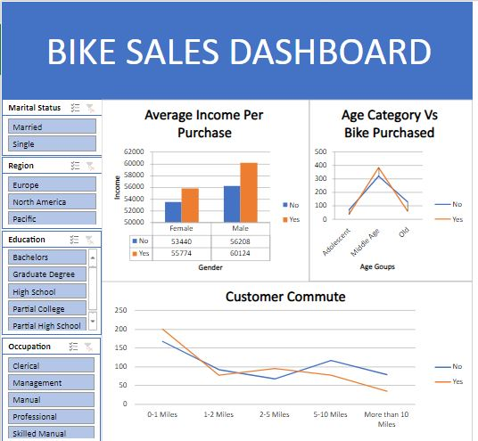

# Bike-buyers-Data-exploration-using-Excel

This repository contains all the Data Exploration on Bike buyers Data Using Excel.

## Problem statement

The objective of this Data Analysis project is to explore the biker dataset and extract meaningful insights that can help us understand biker behavior, preferences, and trends. By doing so, we aim to answer key questions and address specific challenges related to biking.

## Methodology

Steps for Data Exploration mainly include -

* Data Cleaning
* Making charts
* Building Dashboard

## Insights

* Married people who buy a Bike tends to have more income than the single counterpart on an average of 8k.
* Only 40 percent of customers buy bikes which is a concern for the company.
* The average customer is around that of 40 years old. T
* The majority of buyers and non buyers are both in North america with europe and pacific area are left behind.
* only 15 percent of people don't have a car so it tells us that the bikes are bought mainly for hobbies.
* Checking the commuting distance you can see that overall in the graph people who don't buy tend to have a farther commuting distance option maybe opting for another form of              transportation for farther distances.

# DASHBOARD

